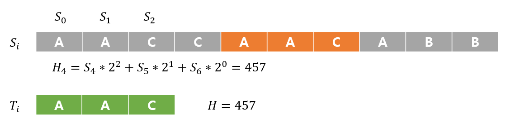

# 라빈 카프 알고리즘

# 라빈 카프 알고리즘은 언제쓰나요?

- 라핀 카프 알고리즘은 **장문의 문자열**에 **특정 문자열**이 **존재하는지 판단**할때 사용한다.

**S** 라는 장문의 문자열이 있고 이 안에 타겟 문자열인 **T** 가 몇개가 매치되는가를 찾는 예제를 통해 설명할 예정이다.

라빈 카프 알고리즘은 굉장히 심플한 알고리즘이다. 이 알고리즘은 **Hash Table**과 비슷한 성질을 이용해서 문자열을 빠르게 찾아내는 알고리즘이다. 문자열을 수치로 변환시켜 수치에 대한 정보를 바탕으로 탐색할 필요없는 후보군을 빠르게 제거해나가는 알고리즘이라고 할 수 있다. 수치로 변환한다는 의미는 라빈 카프 알고리즘에서 사용하는 해쉬함수를 이용해서 문자열을 숫자로 바꾼다는 것이다.

먼저 문자열에 라빈 카프 핑거프린팅 함수를 적용한다. 이는 해쉬 함수와 비슷한 모습의 변환함수로 그 수식은 다음과 같다.

$$H=T_0*2^2+T_1*2^1+T_2*2^0$$

여기서 **H** 는 수치화된 **스칼라값**이며 본 포스팅에서는 **오로지 예제에 대한 수식**만으로 정리하였다.

이 식에서 T_i 가 의미하는 것은

$$T_0='A' , T_1='A',T_2='C'$$

이다.

각 알파벳은 아스키형식으로 'A'=65, 'C'=67 을 의미한다.

이를 정수로 변환한 값에 2의 거듭제곱을 곱하여 더하는 형식으로 되어있다.(임의의 자연수의 거듭제곱이여도 된다.)

이 방식을 따르게 되면 타겟 문자열 T 를 스칼라값으로 변환이 가능하다.

즉, H 는 우리가 찾으려고 하는 문자열의 해쉬 인덱스라고 생각하면된다. 특정 문자열의 해쉬 인덱스가 같다는 얘기는 실제로 문자열이 같을 수 있다는 얘기를 내포한다.

그렇다면 장문의 문자열 **S** 에도 같은 방식으로 문자열 길이를 3씩 나누어 같은 방식으로 변환된 스칼라 값을 찾아나간다. 그 식은 다음과 같다.

$$H_i=S_i*2^2+S_{i+1}*2^1+S_{i+2}*2^0$$

이 식을 이용해서 문자열 **S** 에서 길이 3씩 쪼개서 **H_i**를 계산해보고,

계산된 **H_i** 와 타겟 문자열에서 구한 **H** 가 서로 같은 값이라면 해쉬 인덱스가 같다는 얘기가 된다.

즉 "아마도 같은 문자열" 일 수도 있다는 뜻이다. 

따라서 **H_i** 와 **H** 가 서로 다른 값이라면 그 둘을 죽었다 깨어나도 다른 문자열이라는 얘기다.

우리는 **H** 를 통해서 후보군이 아닌 문자열에 대한 탐색을 제거해 나갈 수 있다는 것이다. 그 방법에 대한 그림은 다음과같다.

먼저 타겟 문자열의 H(해쉬 인덱스,수치화된 값)를 구한다.

문자열 **S** 의 첫부분 부터 **H_0** 값을 구해나가며 **H**와 그 값이 같다면 실제로도 같은지 검사해본다.

값이 다르다면 굳이 검사할 필요가 없이 계속 진행한다.

끝까지 검사해보며 탐색해 나간다.

# 왜 라프 카빈 알고리즘이 더 빠른걸까?

지금까지 얘기하지 않고 지나간 부분이 있다.

라프 카빈 알고리즘의 핵심은 위에서 언급한 식에 나와있다.

$$H_i=S_i*2^2+S_{i+1}*2^1+S_{i+2}*2^0$$

지금은 타겟 문자열의 길이가 3이기 때문에 3개의 수를 곱하고 더하는 것 만으로 수치화 시킬 수 있다. 그런데 만약에 타겟 문자열의 길이가 n 인 경우는 어떨까?

$$H_i=S_i*2^{n-1}+S_{i+1}*2^{n-2}+...+S_{i+n-1}*2^0$$

n이 커지면 커질수록 어차피 **수치화(해쉬 함수 적용)**하는데 많은 비용이 들 것이다.

그런데 과연 **H_i** 를 계산한 이후에 **H_i+1** 을 계산할때 매번 같은 방식으로 계산해야할까?

$$H_{i+1}=S_{i+1}*2^{n-1}+S_{i+2}*2^{n-2}+...+S_{i+n}*2^0$$

$$H_{i+1}=2*{(H_i-S_{i}*2^{n-1})}+S_{i+n-1}*2^0$$

즉, 우리는 **H_i** 를 구하고 그 다음 **H_i+1** 을 구할때 굳이 전부다 계산하지 않아도 된다.

이전의 **H_i** 를 이용하면 간단히 **H_i+1** 을 구할 수 있다.

따라서 라프 카빈 알고리즘은 문자열을 **H_i** 로 수치화하는데 **O(1)** 시간이 걸린다고 할 수 있다. 따라서 전체 문자열을 수치화하는데 얼마 안걸린다.

이를 통해 라빈 카프 해시함수로 구한 해시값을 비교해서 같은 값을 가지는 문자열만 비교해보면된다.

## 끝.

ps. 여기서 자꾸 문자열에 라빈카프 알고리즘만의 해쉬함수를 이용해서 해쉬 인덱스를 구한다라고 얘기했는데 사실 해쉬의 성질을 이용하는것이지 엄밀히 말해서 해쉬 인덱스는 아니다.