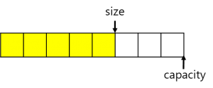

<!-- TOC -->

- [c++ 순차 컨테이너](#c-순차-컨테이너)
- [각 container 의 특징!](#각-container-의-특징)
  - [array<T,N>](#arraytn)
  - [vector<T>](#vectort)
  - [deque<T>](#dequet)
  - [list<T>](#listt)
  - [forward_list<T>](#forward_listt)

<!-- /TOC -->

# c++ 순차 컨테이너

c++ stl의 컨테이너 중에서 순차 컨테이너에 대해 알아보자.<br>
순차 컨테이너의 사용법은 개인이 알아서 익히면 될것같다. 사용하는데에는 큰 어려움은 없을것이지만 이 포스팅에서는
어떠한 경우에 어떤 컨테이너를 쓰면 좋은지에 대해서 간략하게 다루도록 하겠다.<br>
순차 컨테이너는 원소들을 선형적인 순차열으로 저장하는 컨테이너 이다.
여기서 선형적이란건 정렬하지 않는다는 얘기이다. 총 5개의 STL container 가 이에 속하며

- array<T,N>
- vector<T>
- deque<T>
- list<T>
- forward_list<T>

가 있다.

# 각 container 의 특징!

이제부터 각 container 의 특징과 어떤 상황에서 좋은 성능을 보이고 어떤 상황에서는 매우 안좋은 성능을 보이는지를 확인해보자.
이를 통해 자신이 구현하고자하는바에 알맞은 container를 사용하면 될 것이다.

## array<T,N>

타입 T 를 이용해서 컨테이너에 저장할 타입을 정의하고 특별하게 N 으로 고정된 길이를 정의한다.
array에서는 원소를 추가하거나 삭제할 수 없고 고정된 길이 N 을 가져야한다.<br>

- array의 강점은 랜덤 엑세스에서 나온다.
- 길이가 고정되어있기 때문에 특정 index 로 접근이 빠르게된다.
- 하지만 array에서의 가장 큰 단점은 원소를 추가하거나 삭제할 수 없다는 것이다.
- 사실 필자는 잘 쓰지 않고있다.

## vector<T>

vector 는 개인적으로 가장 많이 사용하는 container이다. <br>
컨테이너에 저장할 타입 T 가 정의되며 길이가 가변적이다. push_back 을 통해 데이터를 삽입하거나 pop_back 을 통해 데이터를 삭제할 수 있다.

- vector 의 강점은 데이터의 길이가 가변적인 것이다.
- array 와 마찬가지로 특정 index 데이터에 접근이 빠르다.
- 단점으로는 데이터를 삽입하거나 삭제하는 경우 항상 끝에서만 삽입과 삭제가 가능하다.
- runTime 에 저장해야할 데이터의 갯수가 정해지는 경우 array가 아닌 vector를 이용할 수 있다.
- 중간에 있는 데이터를 삭제할 수 없기 때문에 중간중간에 있는 데이터를 삭제하거나 중간에 데이터를 삽입해야 하는 경우는 알맞지 못하다.

vector container 의 경우는 array와 다르게 사이즈가 정해져있지 않다.<br>
개인적으로는 push_back 을 이용해서 항상 데이터를 삽입하였다. 하지만 가변적인 길이가 가지는 단점이 있다.<br>

```c
vector<int> vec;
```

`vec` 을 선언했다고 하자. 현재는 `vec`에 데이터가 없기 때문에 할당된 공간이 아얘없다.

```c
vec.push_back();
```

을 수행하게 되면 이때 비로소 `vec`에 데이터가 들어오게 되고 할당된 공간은 int 하나의 공간이 된다.
<br>
그렇다는 얘기는 push_back 을 할때마다 memory에 공간을 할당시켜줘야 한다는 얘기이다. array는 처음 정해진 길이 만큼을 가지는 반면
vector 는 push_back 을 할때마다 공간 할당 작업을 해야한다면 이에 대한 오버헤드가 생길 수 밖에 없다.
<br>
그렇기 때문에 vector는 `capacity` 와 `size` 라는 정보를 가지고 있다.

```c
vec.capacity();
vec.size();
```



즉, capacity 는 vec 에 할당되어있는 메모리의 크기를 나타내며 size 는 실제 vector 에 들어있는 원소의 갯수를 말해준다.
vector 컨테이너는 데이터가 입력되는데 capacity에 전부 데이터가 차있는 상태라면 capacity 를 두배로 늘리는 할당을 수행하게된다.
<br>
따라서 삽입을 할때마다 매번 메모리에 새로운 데이터를 위한 자리를 할당하는 것이 아니라 현재 원소의 갯수인 size와 용량인 capacity를 보고
메모리 할당 작업을 진행하게 된다.
<br>그렇다면 효율적으로 코드를 작성하기 위해서는 어떻게 해야될까?

```c
vec.reserve(20);
```

이 코드를 이용한다면 처음부터 vec 의 capacity를 20 으로 설정할 수 있다.
따라서 21번째 원소를 삽입할때 메모리를 추가로 할당하며 그 결과 40의 capacity를 가지게 될 것이다.

```c
vec.resize(20,0);
```

이 코드를 이용하면 처음부터 20개의 초기값 0을 가지는 원소가 애초에 생성되게된다.

<br>
vector 를 사용하는 경우 메모리에 큰 영향이 안가는 한 initial capacity 를 지정해 주는 습관이 필요할 것 같다.

## deque<T>

작성중....

## list<T>

## forward_list<T>
